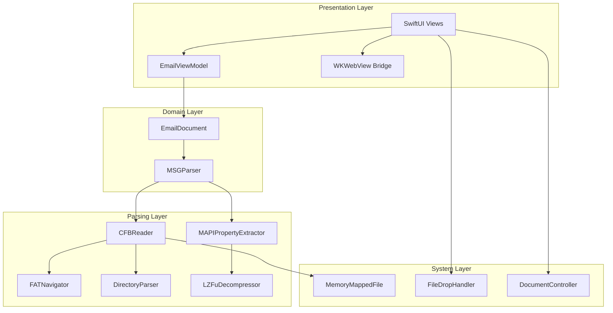
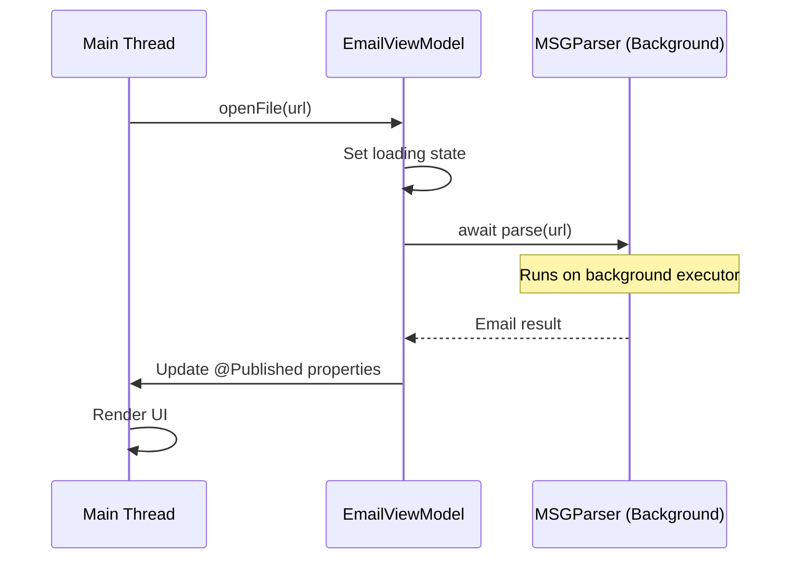

# Design Document: MSG File Viewer

## Overview

The MSG File Viewer is a native macOS application built with Swift and SwiftUI that reads Microsoft Outlook .msg files entirely offline. The core challenge is implementing a compliant OLE/CFB (Compound File Binary Format) parser in pure Swift, extracting MAPI properties to reconstruct email metadata, body content (plain text, HTML, RTF with LZFu decompression), and attachments.

The application uses a layered architecture separating binary parsing, property extraction, and presentation. Performance is achieved through memory-mapped I/O (`mmap`) for large files and background threading via Swift Concurrency (`async/await` with actors). The app runs within a hardened macOS sandbox with network entitlements explicitly denied.

### Key Design Decisions

| Decision | Rationale |
|----------|-----------|
| Pure Swift OLE/CFB parser | No C dependencies; sandboxing-friendly; leverages Swift's Data and UnsafeRawBufferPointer for binary parsing |
| Memory-mapped I/O for files > 1 MB | Avoids loading full 150 MB files into heap; kernel pages in data on demand |
| Swift Concurrency (actors) | Structured concurrency keeps parsing off main thread without GCD complexity |
| WKWebView with network disabled | Only WebKit option on macOS for HTML rendering; all navigation/network policies denied |
| NSAttributedString for RTF | Built-in macOS RTF renderer; avoids third-party dependencies |
| Single-window-per-file model | Each document gets its own window; deduplication by file path |

## Architecture



### Layer Responsibilities

- **Parsing Layer**: Low-level binary reading of OLE/CFB structures. Stateless functions operating on `Data` or memory-mapped buffers. No UI or domain knowledge.
- **Domain Layer**: Orchestrates parsing, maps MAPI properties to Swift domain models (`Email`, `Attachment`, `Recipient`). Owns the `MSGParser` public API.
- **Presentation Layer**: SwiftUI views, view models, WebView bridge. Handles file open/drop events and user interactions.
- **System Layer**: Memory-mapped file access, file coordination, UTType registration, NSDocumentController.

### Threading Model



## Components and Interfaces

### 1. CFBReader

Reads the OLE/CFB binary container format.

```swift
/// Reads OLE Compound File Binary Format structures from raw data.
struct CFBReader {
    /// Parses the CFB header (first 512 bytes) and validates the signature.
    /// - Throws: `CFBError.invalidSignature` if magic bytes don't match.
    static func readHeader(from data: DataReader) throws -> CFBHeader

    /// Builds the complete FAT by reading FAT sectors and DIFAT chain.
    static func buildFAT(header: CFBHeader, reader: DataReader) throws -> [UInt32]

    /// Builds the mini-FAT for streams smaller than the mini-stream cutoff.
    static func buildMiniFAT(header: CFBHeader, fat: [UInt32], reader: DataReader) throws -> [UInt32]

    /// Parses all directory entries from the directory sector chain.
    static func readDirectoryEntries(header: CFBHeader, fat: [UInt32], reader: DataReader) throws -> [DirectoryEntry]

    /// Reads a stream's complete data by following its FAT/mini-FAT chain.
    static func readStream(entry: DirectoryEntry, fat: [UInt32], miniFAT: [UInt32], miniStream: Data, header: CFBHeader, reader: DataReader) throws -> Data
}
```

### 2. DataReader (Protocol)

Abstraction over raw data access, enabling both in-memory and memory-mapped backends.

```swift
/// Protocol for reading binary data from a source.
protocol DataReader {
    /// Total number of bytes available.
    var count: Int { get }

    /// Reads `length` bytes starting at `offset`.
    /// - Throws: `DataReaderError.outOfBounds` if range exceeds data.
    func readBytes(at offset: Int, length: Int) throws -> Data

    /// Reads a fixed-width integer at the given offset (little-endian).
    func readInteger<T: FixedWidthInteger>(at offset: Int) throws -> T
}
```

Conforming types: `InMemoryDataReader` (for files ≤ 1 MB), `MappedDataReader` (for files > 1 MB).

### 3. MAPIPropertyExtractor

Extracts MAPI properties from parsed OLE/CFB streams.

```swift
/// Extracts typed MAPI properties from CFB stream data.
struct MAPIPropertyExtractor {
    /// Extracts all properties from a property stream and its named property mapping.
    static func extractProperties(
        from streams: [String: Data],
        codePage: UInt32?
    ) throws -> [MAPIProperty]

    /// Reads recipient sub-storages and returns typed Recipient values.
    static func extractRecipients(
        from directoryEntries: [DirectoryEntry],
        rootStreams: StreamResolver
    ) throws -> [Recipient]

    /// Reads attachment sub-storages and returns Attachment values.
    static func extractAttachments(
        from directoryEntries: [DirectoryEntry],
        rootStreams: StreamResolver
    ) throws -> [Attachment]
}
```

### 4. LZFuDecompressor

Decompresses RTF bodies stored with Microsoft's LZFu algorithm.

```swift
/// Decompresses LZFu-compressed RTF data as stored in PidTagRtfCompressed.
struct LZFuDecompressor {
    /// The LZFu signature for compressed data: "LZFu"
    static let compressedSignature: UInt32 = 0x75465A4C

    /// The signature for uncompressed (raw) RTF data: "MELA"
    static let uncompressedSignature: UInt32 = 0x414C454D

    /// Decompresses LZFu-encoded RTF data.
    /// - Returns: The decompressed RTF content as Data.
    /// - Throws: `LZFuError.invalidSignature`, `LZFuError.crcMismatch`,
    ///           `LZFuError.corruptedData`
    static func decompress(_ compressedData: Data) throws -> Data
}
```

### 5. MSGParser (Public API)

The top-level parsing API that orchestrates all sub-components.

```swift
/// Parses a .msg file and returns a structured Email model.
actor MSGParser {
    /// Parses the .msg file at the given URL.
    /// - Returns: A fully populated `Email` value.
    /// - Throws: `MSGParserError` with a descriptive message on failure.
    func parse(url: URL) async throws -> Email
}
```

### 6. EmailViewModel

Drives the SwiftUI view layer.

```swift
/// Observable view model for displaying a parsed email.
@MainActor
final class EmailViewModel: ObservableObject {
    @Published var email: Email?
    @Published var isLoading: Bool = false
    @Published var error: MSGParserError?
    @Published var selectedBodyFormat: BodyFormat = .html

    /// Opens and parses a .msg file.
    func openFile(url: URL) async

    /// Exports an attachment to disk via save panel.
    func saveAttachment(_ attachment: Attachment) async
}
```

### 7. OfflineWebView (NSViewRepresentable)

Wraps WKWebView for SwiftUI with all network access disabled.

```swift
/// A WKWebView wrapper that renders HTML with no network access.
struct OfflineWebView: NSViewRepresentable {
    let htmlContent: String

    func makeNSView(context: Context) -> WKWebView {
        let config = WKWebViewConfiguration()
        let prefs = WKWebpagePreferences()
        prefs.allowsContentJavaScript = false
        config.defaultWebpagePreferences = prefs
        // Custom URL scheme handler that blocks all loads
        config.setURLSchemeHandler(BlockingSchemeHandler(), forURLScheme: "blocked")
        let webView = WKWebView(frame: .zero, configuration: config)
        webView.navigationDelegate = context.coordinator // blocks navigation
        return webView
    }

    func updateNSView(_ webView: WKWebView, context: Context) {
        webView.loadHTMLString(htmlContent, baseURL: nil)
    }
}
```

### 8. FileDropHandler

Handles drag-and-drop onto the application window.

```swift
/// Modifier that adds .msg file drop support to any view.
struct FileDropModifier: ViewModifier {
    @Binding var isTargeted: Bool
    let onDrop: (URL) -> Void

    func body(content: Content) -> some View {
        content.onDrop(of: [.fileURL], isTargeted: $isTargeted) { providers in
            // Validate UTType is .msg, invoke onDrop
        }
    }
}
```

## Data Models

### CFB Structures

```swift
/// OLE/CFB file header (512 bytes).
struct CFBHeader {
    let signature: UInt64              // Must be 0xD0CF11E0A1B11AE1
    let minorVersion: UInt16
    let majorVersion: UInt16           // 3 or 4
    let byteOrder: UInt16             // 0xFFFE (little-endian)
    let sectorSizePower: UInt16       // 9 (512 bytes) or 12 (4096 bytes)
    let miniSectorSizePower: UInt16   // 6 (64 bytes)
    let totalFATSectors: UInt32
    let firstDirectorySector: UInt32
    let miniStreamCutoffSize: UInt32  // 4096
    let firstMiniFATSector: UInt32
    let totalMiniFATSectors: UInt32
    let firstDIFATSector: UInt32
    let totalDIFATSectors: UInt32
    let difatArray: [UInt32]          // First 109 DIFAT entries in header

    var sectorSize: Int { 1 << Int(sectorSizePower) }
    var miniSectorSize: Int { 1 << Int(miniSectorSizePower) }
}

/// A directory entry in the CFB structure (128 bytes each).
struct DirectoryEntry {
    let name: String
    let objectType: ObjectType        // Unknown, Storage, Stream, RootStorage
    let startSector: UInt32
    let streamSize: UInt64
    let childID: UInt32
    let leftSiblingID: UInt32
    let rightSiblingID: UInt32
}

enum ObjectType: UInt8 {
    case unknown = 0
    case storage = 1
    case stream = 2
    case rootStorage = 5
}
```

### MAPI Structures

```swift
/// A MAPI property tag consisting of an ID and type.
struct MAPIPropertyTag: Hashable {
    let id: UInt16
    let type: UInt16

    static let subjectUnicode = MAPIPropertyTag(id: 0x0037, type: 0x001F)
    static let subjectAnsi = MAPIPropertyTag(id: 0x0037, type: 0x001E)
    static let senderName = MAPIPropertyTag(id: 0x0C1A, type: 0x001F)
    static let senderEmail = MAPIPropertyTag(id: 0x0C1F, type: 0x001F)
    static let clientSubmitTime = MAPIPropertyTag(id: 0x0039, type: 0x0040)
    static let bodyPlainText = MAPIPropertyTag(id: 0x1000, type: 0x001F)
    static let bodyHtml = MAPIPropertyTag(id: 0x1013, type: 0x0102)
    static let bodyRtfCompressed = MAPIPropertyTag(id: 0x1009, type: 0x0102)
    static let internetCodePage = MAPIPropertyTag(id: 0x3FDE, type: 0x0003)
    static let attachLongFilename = MAPIPropertyTag(id: 0x3707, type: 0x001F)
    static let attachFilename = MAPIPropertyTag(id: 0x3704, type: 0x001F)
    static let attachDataBinary = MAPIPropertyTag(id: 0x3701, type: 0x0102)
    static let attachSize = MAPIPropertyTag(id: 0x0E20, type: 0x0003)
    static let attachMimeTag = MAPIPropertyTag(id: 0x370E, type: 0x001F)
    static let displayName = MAPIPropertyTag(id: 0x3001, type: 0x001F)
    static let emailAddress = MAPIPropertyTag(id: 0x3003, type: 0x001F)
    static let recipientType = MAPIPropertyTag(id: 0x0C15, type: 0x0003)
}

/// A parsed MAPI property with its value.
struct MAPIProperty {
    let tag: MAPIPropertyTag
    let value: MAPIPropertyValue
}

/// Typed MAPI property values.
enum MAPIPropertyValue {
    case string(String)
    case binary(Data)
    case int32(Int32)
    case int64(Int64)
    case time(Date)        // FILETIME → Date
    case boolean(Bool)
}
```

### Domain Models

```swift
/// The fully parsed email representation.
struct Email {
    let subject: String?
    let senderName: String?
    let senderEmail: String?
    let toRecipients: [Recipient]
    let ccRecipients: [Recipient]
    let sentDate: Date?
    let body: EmailBody
    let attachments: [Attachment]
}

/// Represents an email recipient.
struct Recipient {
    let displayName: String?
    let emailAddress: String?
    let type: RecipientType
}

enum RecipientType: Int32 {
    case to = 1     // MAPI_TO
    case cc = 2     // MAPI_CC
    case bcc = 3    // MAPI_BCC
}

/// Available body content for an email.
struct EmailBody {
    let plainText: String?
    let html: String?
    let rtf: Data?           // Decompressed RTF data

    /// Returns the preferred body format based on availability.
    var preferredFormat: BodyFormat {
        if html != nil { return .html }
        if plainText != nil { return .plainText }
        if rtf != nil { return .rtf }
        return .none
    }
}

enum BodyFormat: String, CaseIterable {
    case html = "HTML"
    case plainText = "Plain Text"
    case rtf = "RTF"
    case none = "No Content"
}

/// An email attachment.
struct Attachment: Identifiable {
    let id: UUID
    let filename: String
    let size: Int
    let mimeType: String?
    let data: Data?
    let isCorrupted: Bool

    /// Human-readable size string.
    var formattedSize: String {
        ByteCountFormatter.string(fromByteCount: Int64(size), countStyle: .file)
    }
}
```

### Error Types

```swift
/// Errors from CFB parsing.
enum CFBError: Error, CustomStringConvertible {
    case invalidSignature(expected: String, found: String)
    case corruptedFile(sectorIndex: UInt32, reason: String)
    case unsupportedVersion(UInt16)
    case streamReadFailed(entryName: String, reason: String)

    var description: String {
        switch self {
        case .invalidSignature(let expected, let found):
            return "invalid file format: expected signature \(expected), found \(found)"
        case .corruptedFile(let sector, let reason):
            return "corrupted file at sector \(sector): \(reason)"
        case .unsupportedVersion(let version):
            return "unsupported CFB version: \(version)"
        case .streamReadFailed(let name, let reason):
            return "failed to read stream '\(name)': \(reason)"
        }
    }
}

/// Errors from LZFu decompression.
enum LZFuError: Error {
    case invalidSignature
    case crcMismatch(expected: UInt32, computed: UInt32)
    case corruptedData(position: Int)
    case uncompressedSizeExceeded
}

/// Top-level parser errors exposed to the UI layer.
enum MSGParserError: Error, LocalizedError {
    case fileAccessDenied(URL)
    case invalidFormat(CFBError)
    case propertyExtractionFailed(String)
    case decompressionFailed(LZFuError)

    var errorDescription: String? {
        switch self {
        case .fileAccessDenied(let url):
            return "Unable to open file: access denied to \(url.lastPathComponent)"
        case .invalidFormat(let cfbError):
            return "Unable to open file: \(cfbError.description)"
        case .propertyExtractionFailed(let detail):
            return "Failed to extract email data: \(detail)"
        case .decompressionFailed(let lzfuError):
            return "RTF decompression failed: \(lzfuError)"
        }
    }
}
```

## Correctness Properties

*A property is a characteristic or behavior that should hold true across all valid executions of a system — essentially, a formal statement about what the system should do. Properties serve as the bridge between human-readable specifications and machine-verifiable correctness guarantees.*

### Property 1: CFB Signature Validation

*For any* byte buffer of at least 8 bytes, the CFB header parser SHALL accept the buffer if and only if the first 8 bytes equal the OLE/CFB magic signature (0xD0CF11E0A1B11AE1), and SHALL return an error containing "invalid file format" for all other byte sequences.

**Validates: Requirements 1.1, 1.5**

### Property 2: FAT Chain Stream Reconstruction

*For any* valid CFB structure with a stream spread across N sectors (including cases requiring DIFAT and mini-stream), reading the stream by following its FAT chain SHALL produce data byte-for-byte identical to the original stream content, regardless of sector count, chain length, or whether the stream uses the mini-FAT (size < 4096) or regular FAT.

**Validates: Requirements 1.2, 1.3, 1.4**

### Property 3: Corrupted Sector Chain Error Reporting

*For any* valid CFB file where a single sector in a FAT chain is corrupted (set to an invalid sector index), the parser SHALL return an error containing "corrupted file" and the sector index of the corrupted entry, without crashing or entering an infinite loop.

**Validates: Requirements 1.6**

### Property 4: MAPI Property Extraction Round-Trip

*For any* set of MAPI properties (subject, sender name, sender email, sent date) encoded into a valid property stream with a given code page, extracting those properties SHALL produce values identical to the originals. Missing properties SHALL produce nil without affecting extraction of present properties.

**Validates: Requirements 2.1, 2.2, 2.5, 2.6, 2.7**

### Property 5: Recipient Extraction Completeness

*For any* set of N recipients (of type TO or CC) encoded into recipient sub-storages, the extractor SHALL return exactly N recipients of the correct type, each with their original display name and email address preserved.

**Validates: Requirements 2.3, 2.4, 2.8**

### Property 6: Body Content Extraction Round-Trip

*For any* text string encoded as a plain text body property or HTML body property with a given character encoding, extracting and decoding the body SHALL produce a string identical to the original.

**Validates: Requirements 3.1, 3.2**

### Property 7: LZFu Decompression Round-Trip

*For any* valid RTF content, compressing it with the LZFu algorithm and then decompressing SHALL produce output byte-for-byte identical to the original RTF data.

**Validates: Requirements 3.3**

### Property 8: Body Format Priority Selection

*For any* combination of present/absent body formats (HTML, plain text, RTF), the preferred format SHALL be the highest-priority format that is present (HTML > plain text > RTF), and if a format's extraction fails, the next available format SHALL be selected.

**Validates: Requirements 3.4, 3.7**

### Property 9: Attachment Extraction Round-Trip

*For any* attachment with a filename, binary data, and optional MIME type encoded into an attachment sub-storage, extraction SHALL produce an Attachment with the correct filename (preferring long filename over short), binary data identical to the original, correct size, and matching MIME type. If binary data is corrupted, the attachment SHALL be marked as corrupted with nil data.

**Validates: Requirements 4.1, 4.2, 4.3, 4.6, 4.7**

### Property 10: File Size Formatting

*For any* non-negative integer byte count, the formatter SHALL produce a human-readable string with appropriate units (bytes, KB, MB) that is non-empty and contains a numeric value.

**Validates: Requirements 4.5**

### Property 11: Email Display Metadata Formatting

*For any* Email value, the display logic SHALL: (a) show "Unknown Sender" if and only if both senderName and senderEmail are nil; (b) show "No Date" if and only if sentDate is nil; (c) hide the CC row if and only if ccRecipients is empty; (d) hide the attachment section if and only if the attachments array is empty.

**Validates: Requirements 5.2, 5.3, 5.4, 5.8**

### Property 12: Window Deduplication and Limit

*For any* sequence of file open requests, the number of open windows SHALL never exceed 20, and opening a file whose path matches an already-open window SHALL bring the existing window to front rather than creating a new window.

**Validates: Requirements 6.6**

### Property 13: Invalid File Rejection

*For any* file that is not a valid .msg file (non-.msg extension or invalid OLE/CFB signature), attempting to open it SHALL produce an error alert containing the text "Unable to open file".

**Validates: Requirements 6.7**

## Error Handling

### Parsing Layer Errors

| Error Condition | Behavior | Recovery |
|----------------|----------|----------|
| Invalid CFB signature | Return `CFBError.invalidSignature` with expected/found bytes | Display alert to user |
| Corrupted sector chain | Return `CFBError.corruptedFile` with sector index | Display alert to user |
| FAT cycle detected | Break chain follow at max sector count (file size / sector size) | Return corrupted error |
| Stream read out of bounds | Return `CFBError.streamReadFailed` | Display alert to user |
| Missing MAPI property | Return nil for that field | Continue with remaining properties |
| Invalid property type | Skip property, log warning | Continue extraction |
| LZFu CRC mismatch | Return `LZFuError.crcMismatch` | Fall through to next body format |
| LZFu corrupted data | Return `LZFuError.corruptedData` | Fall through to next body format |
| Attachment data corrupted | Mark attachment `isCorrupted = true` | Show error indicator in UI |

### Presentation Layer Errors

| Error Condition | Behavior |
|----------------|----------|
| File access denied (sandbox) | Alert: "Unable to open file: access denied to {filename}" |
| Invalid file format | Alert: "Unable to open file: {error description}" |
| Body rendering failure | Show "Unable to display content" placeholder |
| Attachment save failure | Alert: "Could not save attachment: {error}" |
| Window limit reached (20) | Alert: "Maximum number of windows reached" |

### Design Principles

- **Fail gracefully**: Parser errors for individual components (body format, single attachment) do not prevent displaying the rest of the email.
- **No crashes**: All binary parsing uses bounds-checked access. Invalid data produces errors, never `fatalError` or uncaught exceptions.
- **Informative errors**: Error messages include specific context (sector index, property name, file path) for debugging.
- **Main thread safety**: All throwing paths are handled in the background actor; only final results propagate to `@MainActor`.

## Testing Strategy

### Property-Based Testing

The project will use **SwiftCheck** (or `swift-testing` with custom generators if targeting Swift 6) for property-based testing. Each correctness property maps to one property-based test with a minimum of 100 iterations.

**Test Configuration:**
- Library: SwiftCheck (`https://github.com/typelift/SwiftCheck`)
- Minimum iterations: 100 per property
- Tag format: `// Feature: msg-file-viewer, Property {N}: {title}`

**Custom Generators Required:**
- `CFBStructureGenerator`: Generates valid CFB headers, FAT chains, and directory entries
- `MAPIPropertyStreamGenerator`: Generates property streams with typed MAPI values
- `RecipientStorageGenerator`: Generates recipient sub-storages with varying counts
- `LZFuDataGenerator`: Generates RTF data and its LZFu-compressed form
- `AttachmentStorageGenerator`: Generates attachment sub-storages with filenames, data, and MIME types
- `EmailGenerator`: Generates complete Email values with random field presence

### Unit Tests (Example-Based)

| Area | Tests |
|------|-------|
| CFB header parsing | Specific valid/invalid header bytes |
| Known .msg files | Parse reference .msg files with known content |
| Body format priority | Specific combinations (HTML+RTF, only plain text, etc.) |
| RTF rendering | NSAttributedString produces non-nil output for valid RTF |
| WebView config | JavaScript disabled, no network scheme handlers |
| File open dialog | Filters to .msg UTType |
| Drop handler | Accepts .msg, rejects .txt |
| Save attachment | Writes correct bytes to disk |

### Integration Tests

| Area | Tests |
|------|-------|
| End-to-end parse | Open real .msg files (small, medium, large) and verify full Email model |
| Performance | 10 MB file parses in < 500ms, 150 MB file in < 3s (Apple Silicon) |
| Memory-mapped I/O | Large file uses mmap, not full heap allocation |
| Main thread | Parsing large file does not block main thread > 100ms |
| Window management | Multiple opens, deduplication, 20-window limit |

### Smoke Tests

| Area | Tests |
|------|-------|
| Info.plist UTType | .msg extension declared |
| Entitlements | `com.apple.security.network.client` is false |
| App launch | Window appears within 1 second |
| No network code | Static analysis / grep for URLSession, Network.framework |

